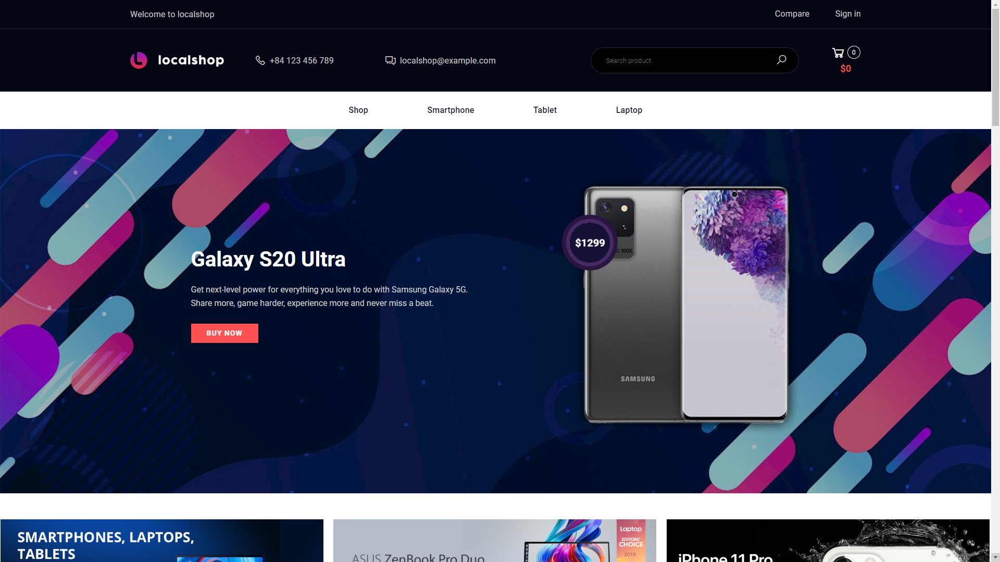

	
</h1>

 

<h1 align="center">
	<a href="http://www.localshop.somee.com">localshop</a>
</h1>

<strong>electronic store</strong>

	
	
	
	
	

 
 

	<a href="http://localshop.somee.com" alt="localshop">localshop</a> is a opensource ecommerce shopping built with ASP.NET MVC 5, Entity Framework 6

 

  

&nbsp;

## Highlights

### Technology & Design

* Backend using `ASP.NET 4.7`, `ASP.NET MVC 5`, `Entity Framework 6`, `ASP.NET Identity`
* Design patterns: `Repository pattern`
* Frontend using `Bootstrap 4`, `jQuery`

### Features

#### Client
*  **Account**: Login, Register, Change password, Update infomation, View list orders.
* **Cart**: Add to cart, Update cart, Checkout
* **Wishlist**, **Compare**
#### Admin
*  **Account**: Login, Update infomation
* **User**: View, Change role, Delete
* **Homepage**: Change promo product, Create/Update/Delete banner
* **Product**: CRUD Product
* **Review**: CRUD Review
* **Order**: Tracking, Update status
* **Category**: CRUD category
* **Contact**: Read contact
* **Configuration**: Change app config

## Try it online

* [**Admin**](http://www.localshop.somee.com/admin) (User: admin@localshop.com, PWD: Admin123@localshop.hau)

## How to install

* Clone repo to your computer
* Open in Visual Studio (localshop.sln). Make sure Visual Studio 2017+ installed on your PC
* In localshop.Web
  * Rename `AppSettings.config.sample` to `AppSettings.config`
  * Replace your infomation in `AppSettings.config`
  * Change your host name in `ConnectionString (Web.config)` if your host name is different from me
* Open Package Manager Console and run `Update-Database -ProjectName localshop.Domain`
* `Ctrl + F5` to build and run solution

### System requirements

* IIS 7+
* ASP.NET 4.7+
* MS SQL Server 2019 Express (or higher)
* Visual C++ Redistributable for Visual Studio 2019 ([Download](https://www.microsoft.com/en-US/download/details.aspx?id=52685))

## License

* Shopping theme: [Daxone](https://demo.hasthemes.com/shopify/daxone-tf.html)
* Admin theme: [Adminto](https://coderthemes.com/adminto/)
